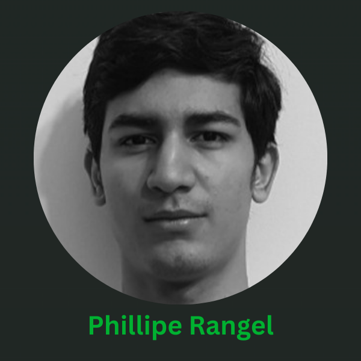

# C\#

**O que é:**\
C# (pronunciado "C-sharp") é uma linguagem de programação orientada a objetos desenvolvida pela Microsoft, amplamente utilizada para o desenvolvimento de aplicativos desktop, web, mobile e jogos, principalmente no ecossistema .NET. C# é conhecida por sua sintaxe clara e eficiente, permitindo a criação de aplicativos robustos e escaláveis. A linguagem oferece suporte para diversas funcionalidades modernas, como tipagem estática, gerenciamento automático de memória (garbage collection), e uma vasta biblioteca de classes através do .NET Framework, Core e .NET 5+.

<strong>Quem pode ajudar:</strong>

**Quem fornece os acessos:**\
Ferramenta Open Source

**Onde posso estudar:**\
Aqui estão algumas ótimas fontes de estudo para aprender C#:

* [Documentação Oficial do C#](https://learn.microsoft.com/en-us/dotnet/csharp/): A documentação oficial da Microsoft fornece guias, tutoriais e exemplos práticos sobre a linguagem e seu uso no ecossistema .NET.
* [C# Programming Yellow Book](http://www.csharpcourse.com/): Livro gratuito para aprender C# de forma clara e acessível, cobrindo desde o básico até tópicos avançados.
* [YouTube - C# Tutorials](https://www.youtube.com/results?search_query=c%23+tutorials): Tutoriais em vídeo sobre programação em C# em diferentes níveis, de iniciantes a avançados.
*   [https://learn.microsoft.com/en-us/shows/csharp-fundamentals-for-absolute-beginners/](https://learn.microsoft.com/en-us/shows/csharp-fundamentals-for-absolute-beginners/)

    Este curso gratuito da Microsoft é ideal para iniciantes e cobre os conceitos fundamentais do C#, incluindo sintaxe básica, estruturas de controle e programação orientada a objetos.
*   [https://www.udemy.com/course/c-advanced-concepts/?couponCode=2021PM25](https://www.udemy.com/course/c-advanced-concepts/?couponCode=2021PM25)

    Este curso pago é voltado para desenvolvedores que desejam aprofundar seus conhecimentos em C#. Cobre tópicos avançados como programação assíncrona, design patterns, e técnicas de otimização. Oferece acesso vitalício e um certificado de conclusão.
