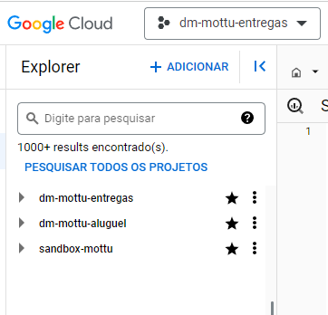

# Migração de bancos de dados

## Aprendendo a migrar dados do dm/sandbox para o dataform.

Primeiramente, o Mineiro oferece um material de estudos para entender o processo de **migração** que está disponível aqui:

[3.1 - Entendendo as políticas de acesso ao ambiente de dados.pdf](<../../../.gitbook/assets/3.1_ _Entendendo_as_polticas_de_acesso_ao_ambiente_de_dados.pdf>)

[3.2 - Novo processo de criação de relatórios.pdf](<../../../.gitbook/assets/3.2_ _Novo_processo_de_criao_de_relatrios.pdf>)

[3.3 - Conhecendo o Dataform.pdf](<../../../.gitbook/assets/3.3_ _Conhecendo_o_Dataform.pdf>)

[3.4 - Entendendo os tipos de rotinas do Dataform e quando usar cada uma.pdf](<../../../.gitbook/assets/3.4_ _Entendendo_os_tipos_de_rotinas_do_Dataform_e_quando_usar_cada_uma.pdf>)

[3.5 - Levando seu código para produção - Ciclo de desenvolvimento e CI CD.pdf](<../../../.gitbook/assets/3.5_ _Levando_seu_cdigo_para_produo_ _Ciclo_de_desenvolvimento_e_CI_CD.pdf>)

[3.6 - Monitoramento.pdf](<../../../.gitbook/assets/3.6_ _Monitoramento.pdf>)

O conteudo seguinte é um adicional para ajudar no passo a passo para quem não tem muita familiaridade com banco de dados. Use esse material como um complemento ao material oferecido acima

Migrar os dados do sandbox/dm para o dataform é importante pois poderá criar novas tabelas ou converter tabelas do sandbox para o dm. Então para continuar a ter acesso aos dados, é necessário que eles estejam presentes dentro do projeto **dm-mottu-entregas** ou do **dm-mottu-aluguel**.

Primeiro, você precisa saber de algumas coisas:

Para acessar os dados no novo modelo, é necessário acesso aos projetos **dm-mottu-entregas** e **dm-mottu-aluguel**, dependendo de quais dados você deseja. O acesso à esses projetos é fornecido pelo time Data Analytics. Ele tem que atribuir ao seu **Google Cloud BigQuery**, acesso a esses projetos E tem que dar permissão ao uso do projeto. São 2 coisas diferentes e para o acesso é necessário os 2. Uma vez com esses acessos, pode utilizar dos dados nesses bancos.

#### Informações sobre os acessos

Antes de começarmos o processo de migrar, um aviso importante. A pessoa que quer migrar os dados precisa ter acesso de **Data Owner**, e esse acesso também é fornecido pelo Data Analytics. Pessoas sem esse acesso não poderão fazer as migrações. Esse acesso é mais restrito, então caso não tenha e não vá receber essa permissão, procure alguém que tenha.

Vou atualizar esse guia continuamente com quem tem esses acessos e de que área a pessoa é. Procurar a mais coerente para a migração desejada.

#### O que migrar?

A primeira coisa para o processo de migração é definir que dados você deseja inserir dentro dos projetos. Para isso, o projeto **sandbox-mottu** é muito importante. Ele possui um limite de tráfego diario de dados de 100gb por usuário, e nele, todos os dados do datamart estão presentes, porém ele é atualizado 1 vez por semana. Logo, ele não é uma fonte de dados confiáveis para qualquer consulta que dependa dos últimos 7 dias. O propósito dele é praticar SQL num ambiente seguro e consultar dados e tabelas passadas.

Com o sandbox-mottu, da para verificar quais dados do datamart você quer. Mas tome cuidado, muitas das tabelas dentro dele não são a fonte original do dado. Para achar a fonte do dado, escreva o endereço do banco, ex: (`datamart-delivery.Financeiro.vw_usuario_lojista`) segure Ctrl e clique com o botão esquerdo na tabela.

Na nova aba, você terá as informações dessa tabela. Nessa aba, vá na aba detalhes e verifique se ela é a fonte original dos dados. Para isso, escrole a tela até o final. Caso tenha uma consulta de sql, essa tabela na verdade é uma tabela intermediária que está pegando os dados das tabelas dentro dessa consulta e portanto, não é a fonte dos dados que você irá migrar.

Caso não haja a consulta, a tabela pode ser utilizada como fonte. Nesse caso, guarde o endereço dessa tabela (a linha na parte ID da tabela, no topo dessa mesma aba detalhes) e estude quais dados essa tabela tem e como ela é estruturada. Você precisará ter um mínimo de compreensão sobre ela para a migração.

## Agora que sei qual dado quero e onde ele está, como eu migro?

#### Primeiro, verificar redundância

Verifique se esses dados realmente não estão presentes dentro do dataform.



Para isso, tem 4 formas:

* No espaço de busca da imagem acima, pesquise pelo nome da tabela que você quer migrar ou por dados importantes nessa tabela
* Abra as pastas dos projetos (as setas cinzas antes dos nomes) e explore se tem uma tabela com uma função similar
* Pergunte para pessoas da área que utilizam tabelas com valores parecidos onde elas extraem os dados
* Essa query verifica se existe uma coluna com esse nome dentro de um banco de dados e, caso tenha, te informa o nome do banco. Substituir o endereço.dataset pelo nome do banco de dados na parte do from e o nome da coluna onde está escrito “nome da coluna”

```sql
SELECT
table_name,
column_name
FROM
endereço.dataset.INFORMATION_SCHEMA.COLUMNS
WHERE
column_name = 'Nome Coluna'
```

Exemplo: vamos ver quais tabelas eu posso achar o Id matriz de um lojista

```sql
SELECT
table_name,
column_name
FROM
dm-mottu-entregas.ent_cross.INFORMATION_SCHEMA.COLUMNS
WHERE
column_name = 'ID_Matriz'
```

E retorna:

#### Os dados realmente não existem no dataform? Então vamos migrar!

Na tela principal, acesse a opção Dataform na aba lateral conforme imagem

Dentro da aba do Dataform, clique na opção cross conforme imagem

Na pasta do cross, terá o repositório do GitHub com os diferentes ambientes de trabalho. Para fazer a migração, é necessário ter o seu ambiente de trabalho e para ter um, terá que pedir para o Mineiro.

Uma vez que tenha seu ambiente, você agora poderá realmente começar o seu processo de migração.

Abra seu ambiente:

O primeiro passo é garantir que o seu dataforms está atualizado. Em baixo da palavra arquivos terá um check verde, caso o seu espaço esteja atualizado. ou terá a palavra PULL caso contrário. Clique no botão PULL para atualizar.

Agora abra a pasta definitions para começar a explorar o dataforms

Aqui estará as principais pastas que iremos interagir. Tem 2 pontos de interesses primários:

* A pasta \_source é onde os dados são importados para dentro desse ambiente.
* As pastas cross, financeiro e h3 são as que possuem a maior quantidade de dados. As primeiras para verificar os dados que você quer.

Vamos entender a pasta source:

Nos iremos interagir com 2 arquivos javascript aqui: o arquivo delivery\_v3.js e o sql\_server.js

Esses arquivo são as pasta que estão abertas no lado direito da imagem acima.

Observe que existem várias sequências desse modelo de código dentro dos 2 arquivos:

```
declare({
database: "warehouse-mottu-entregas",
schema: "cur_delivery",
 name: "gp_fixed_service_extract_public_Extracts",
});
```

O delivery\_v3.js tem as bases que tem o schema cur\_delivery e o sql\_server.js tem as bases que tem o schema cur\_cloud\_sql. Quando for inserir o schema dentro desses sources, tem que colocar dentro da pasta com os schemas iguais.

Para cada database que você importar aqui do antigo datamart, você terá que fazer esse modelo de código para introduzir os dados nesse ambiente. E onde você pega esses dados? Simples, é o ID da tabela que mostre como achar várias páginas acima! Vamos entender um pouco esse código para criarmos o novo modelo:

* As linhas do declare e do database ficarão iguais.
* A linha do schema, você irá alterar a frase que está dentro das aspas duplas. Essa é a dataset do seu ID da tabela, que é o texto entre os 2 pontos. Exemplo: a parte vermelha desse.
* E na parte name, dentro das aspas duplas, colocar o resto do nome depois do segundo ponto Exemplo: a parte vermelha desse.
*   Resultando num declare assim

    ```sql
    declare({
    database: "warehouse-mottu-entregas",
    schema: "cur_delivery",
     name: "integration_partners_public_orders",
    });
    ```

    Tendo feito isso, os dados da cur\_delivery.integration\_partners\_public\_orders estará disponível dentro desse ambiente.

#### Pronto! Migrei os dados, certo? NÃO!

Agora precisamos configurar uma tabela para acessa os dados. As informações novas estão no ambiente do dataforms, mas é necessário configurar alguma tabela para que as informações sejam puxadas e se tornem acessíveis para o usuário.

Isso pode ser feito de 2 formas:

* Adicionando as colunas que você quer à uma Tabela já existente
*   Criando uma nova Tabela

    Para decidir qual das 2 opções acima é necessário cuidado pois ambas possuem benefícios e problemas.

#### Adicionando as colunas à uma tabela já existente:

Digamos que você deseja saber que bairro os entregadores de uma certa região estão dispostos a entregar para ver quais entregadores estariam disponíveis para um novo lojista

A tabela conexao\_pedidos\_externos não possui uma coluna com o Id Matriz de um lojista. E nesse exemplo, precisamos dessa coluna por um motivo ou outro. Vamos então adicionar essa coluna à essa tabela. Primeiro, precisamos de uma fonte confiável e completa da coluna que tenha os dados dos ids matrizes. Procure se já existe uma tabela com esses dados e que pode ser conectado com a tabela atual. Caso não tenha, tem uma sessão no começo do documento ensina como achar isso no datamart.

No exemplo do Id Matriz, temos esses dados na própria dm-mottu-entregas em várias tabelas diferentes. Vamos então pegar na usuario\_lojista e adicionar nessa tabela.

Para isso, basta adicionar a coluna dentro da tabela como se fosse SQL normal. Fazer o join, conectar por uma tabela e adicionar a coluna. A única diferença é a forma como a tabela externa é puxada. No nosso exemplo, o join ficaria:

```sql
JOIN ${ref("usuario_lojista")}
```

Basta colocar como referência à tabela que você quer acessar com a forma ${ref(”NomeDaTabela”)} Escreva o código com os mesmos cuidados que você teria com o SQL. Cuidado com qual join você usa, se as informações são equivalentes entre as 2 tabelas e cuidado com qualquer outra nuance que poderia dar problema em um código SQL

*   conexao\_pedidos\_externos original

    ```sql
    config {
            type: "table",
            tags: ["daily", "financeiro"],
            schema:  dataform.projectConfig.vars.financeiro_schema,
            description: `
                Descrição: Tabela para conectar os pedidos com os códigos externos de alguns lojistas
                Unidade de negócio: Mottu Entregas
                Área: Financeiro
                Criado por: Vinicius Pedroso dos Reis
                Data da ultima atualização do código da tabela: 30/01/2024
                Frequência de atualização: diária. 
                Dados não estão agrupados
                Fuso horário das datas da tabela: Brazil UTC-03 `
        }

    SELECT
    	id										                                      AS chavePrimaria,
    	mottu_order_id									                            AS IdMottu,
    	external_order_id								                            AS orderId,
    	mottu_user_id									                              AS IdUsuario,
    	origin										                                  AS origem,
    	status										                                  AS status,
    	TIMESTAMP(DATETIME(createdAt, "America/Sao_Paulo")) 				AS criacaoData,
      DATE(TIMESTAMP(DATETIME(createdAt, "America/Sao_Paulo")))  	AS Data,
    	updatedAt									                                  AS updatedAt,
    	partner_id									                                AS IdParceiro,
    	distance									                                  AS distancia,
    	job_id										                                  AS IdJob
    	FROM ${ref("integration_partners_public_orders")}

    ```
*   conexao\_pedidos\_externos com a linha de Id Matriz

    ```sql
    config {
            type: "table",
            tags: ["daily", "financeiro"],
            schema:  dataform.projectConfig.vars.financeiro_schema,
            description: `
                Descrição: Tabela para conectar os pedidos com os códigos externos de alguns lojistas
                Unidade de negócio: Mottu Entregas
                Área: Financeiro
                Criado por: Vinicius Pedroso dos Reis
                Data da ultima atualização do código da tabela: 30/01/2024
                Frequência de atualização: diária. 
                Dados não estão agrupados
                Fuso horário das datas da tabela: Brazil UTC-03 `
        }

    SELECT
    	ORD.id								                                        AS chavePrimaria,
    	ORD.mottu_order_id									                            AS IdMottu,
    	ORD.external_order_id								                            AS orderId,
    	ORD.mottu_user_id									                              AS IdUsuario,
    	ORD.origin										                                  AS origem,
    	ORD.status										                                  AS status,
    	TIMESTAMP(DATETIME(ORD.createdAt, "America/Sao_Paulo")) 				AS criacaoData,
      DATE(TIMESTAMP(DATETIME(ORD.createdAt, "America/Sao_Paulo")))  	AS Data,
    	ORD.updatedAt									                                  AS updatedAt,
    	ORD.partner_id									                                AS IdParceiro,
    	ORD.distance									                                  AS distancia,
    	ORD.job_id										                                  AS IdJob,
    	ULO.ID_Matriz                                                   AS ID_Matriz
      
    FROM ${ref("integration_partners_public_orders")} ORD
     JOIN ${ref("usuario_lojista")} ULO ON ORD.mottu_user_id = ULO.ID_Estabelecimento

    ```

#### Certo, isso coloca dados em uma tabela já existente. Mas como criar uma do 0? Vamos ver:

Primeiro, temos que ter os dados para a tabela que queremos criar. Pode ser colocando um novo schema dentro dos sources com mostrado acima. Pode ser utilizando dados já presentes dentro do dm-mottu-entrega ou dm-mottu-aluguel ou uma mistura dos 2 pegando dados das 2 fontes e utilizando para construir uma nova tabela.

Certo, rastreamos onde estão os dados. Bora construir a tabela.

Primeiro, crie um arquivo novo dentro da pasta que seja referente à área que se relaciona com a tabela. Por exemplo, caso queira criar uma tabela sobre cálculos de faturamentos, a pasta ideal seria a do financeiro como mostra a imagem:

Clique nos 3 pontinhos do lado da pasta do Financeiro e depois em criar arquivo.

Crie o arquivo com um nome coerente para a função da tabela e finalize o nome dele com .sqlx

Como no exemplo abaixo:

#### Agora vamos configurar esse arquivo

Acesse ele e você verá que teremos um arquivo vazio. Esse arquivo terá 2 partes. A configuração no topo dele e o código de SQL depois da configuração. Para fazer a configuração, vou usar a config de uma das tabelas do financeiro para exemplificar.

```jsx
config {
        type: "table",
        tags: ["daily", "financeiro"],
        schema:  dataform.projectConfig.vars.financeiro_schema,
        description: `
            Descrição: Descrição da tabela
            Unidade de negócio: Mottu Entregas
            Área: Financeiro
            Criado por: Vinicius Pedroso dos Reis
            Data da ultima atualização do código da tabela: 20/01/2024
            Frequência de atualização: diária. 
            Dados não estão agrupados
            Fuso horário das datas da tabela: Brazil UTC-03 `
    }
```

Copie o config de outro arquivo na mesma pasta e altere as informações para o caso da sua tabela. A parte da description é só informações da tabela em si. Já type, tags e schema são códigos que tem que ser escrito com cuidados. Vamos entende-los

*   Type é um tipo de rotina e pode ser 3 tipos diferentes:

    * View: uma rotina que deve ser usado apenas para consultas leves e raras devido ao custo de se realizar a consulta
    * Table: o tipo padrão a ser utilizado. Útil para consultas frequentes
    * Incremental: usado para alto volumes de processamento.

    O modelo de rotina que a nova consulta terá é importante e merece uma discução mais profunda. Vamos ver o que são os tags e schemas e então, entenderemos o Type.
*   As Tags definem 2 informações importantes sobre a tabela. A frequência que ela será atualizada e o assunto da tabela.

    No exemplo acima, as tags definem que a tabela será atualizada diariamente “daily” e que pertence ao conjunto de tabelas do “financeiro”. Escreva as tags do seu código substituindo os termos daily e financeiro pelos termos referentes à frequência de atualização e à area pertencente à sua tabela. O padrão de atualização é daily, mas pode modificar para outros períodos se a troca for coerente.
*   O Schema é a parte mais automática do processo. Basta reescrever o código do exemplo alternado o schema para a pasta do seu arquivo de acordo com esse modelo:

    ```jsx

    schema: dataform.projectConfig.vars.”nome_do_dataset_sem_prefixo_da_area”_schema,
    ```

    Os schemas das outras tabelas na mesma pasta estarão configuradas corretamente. Você pode só copiar essa linha de outra tabela nessa mesma pasta e copiar no lugar da sua.

Após essas definições, vem a description.

Nessa região, complete a região com dados importantes sobre a tabela. É bem intuitivo essa parte.

#### Table, View ou Incremental?

Vamos entender qual modelo deve ser utilizado na área Type da configuração da sua tabela.

O Mineiro tem um texto excelente nesse arquivo. Leia ele para entender como cada um dos 3 modelos se comportam.

3.4 - Entendendo os tipos de rotinas do Dataform e quando usar cada uma.pdf

Após considerar as opções disponíveis e acabar de configurar a sua tabela, vem a parte de SQL

#### Configurei. Agora hora do SQL

Essa parte é só estruturar a tabela que você quer puxando os dados das tabelas relevantes como no caso do SQL, com apenas a diferência na forma de chamar a tabela. Como exemplo, vamos falar da query de períodos de fatura criada recentemente:

*   faturamento\_periodo

    ```jsx
    config {
            type: "table",
            tags: ["daily", "financeiro"],
            schema:  dataform.projectConfig.vars.financeiro_schema,
            description: `
                Descrição: Tabela que contem os dados de cada faturamento por cada lojista
                Unidade de negócio: Mottu Entregas
                Área: Financeiro
                Criado por: Vinicius Pedroso dos Reis
                Data da ultima atualização do código da tabela: 08/02/2024
                Frequência de atualização: diária. 
                Dados não estão agrupados
                Fuso horário das datas da tabela: Brazil UTC-03 `
        }

    WITH
       TB_Nome_Responsavel AS (
        SELECT 
        ULOTemp.Estabelecimento_Nome AS lojistaMatrizNome, 
        ULOTemp.ID_Matriz 
        FROM ${ref("usuario_lojista")} ULOTemp

        WHERE ULOTemp.ID_Estabelecimento = ULOTemp.ID_Matriz

      ),

       TB_LPP AS (
           SELECT
                 LPP.usuarioId                       AS ID_Estabelecimento
               , ULO.Estabelecimento_Nome            AS Nome_Estabelecimento
               , ULO.ID_Matriz                       AS ID_Matriz
               , TBNome.lojistaMatrizNome            AS Nome_Matriz
               , LPP.valorTotal                      AS ValorTotal
               , LPP.pago                            AS Pago
               , LPP.dataInicioPeriodo               AS DataInicioPeriodo
               , LPP.dataVencimentoPeriodo           AS DataVencimentoPeriodo
    	   , LPP.valorPago                             AS ValorPago
    	   , LPP.pagamentoData                         AS PagamentoData
    	   , LPP.lojistaPeriodoPagamentoTipoID         AS LojistaPeriodoPagamentoTipoID
    	   , CAST(LPP.dataFimPeriodo AS DATE)          AS DataFimPeriodo
          , LPP.valorMulta                           AS ValorMulta
          , LPP.valorJuros                           AS ValorJuros
          , LPP.valorAcrescimo                       AS ValorAcrescimo
          , LPP.valorDesconto                        AS ValorDesconto
           FROM
               ${ref("lojistaPeriodoPagamento")} LPP
            JOIN 
    	   ${ref("usuario_lojista")} ULO ON LPP.usuarioId = ULO.ID_Estabelecimento
    	JOIN 
    	   TB_Nome_Responsavel TBNome ON ULO.ID_Matriz = TBNome.ID_Matriz
       )   

    SELECT * FROM TB_LPP
    ```

Os dados que eu quero estão na fonte cur\_cloud\_sql.lojistaPeriodoPagamento que não estão dentro do ambiente do dm-mottu-entregas. Então coloquei elas lá seguindo os passos acima já descritos. Uma vez com os dados, fiz o config, optei por table como modelo de rotina e escrevi o código SQL para estrutar a consulta que eu preciso.

Pronto. Coloquei os dados dentro do source, fiz o config, escrevi a tabela que irei consultar no futuro. A migração está quase completa. Só falta agora confirmar e aprovar a inserção dela.

Clique em executar e verifique se as informações estão corretas

Uma vez que tudo esteja funcionando, podemos confirmar a migração.

#### Finalizando a migração:

Agora que configuramos tudo, na aba lateral, terá a opção de confirmar alterações

Selecione os arquivos que quer confirmar arquivos

E escreva o motivo da sua migração. Fale o uso da tabela e porque precisa dela. E então confirme

Você será direcionado para a tela anterior, mas ao invés de confirmar alterações terá um request para fazer o PUSH. Clique no PUSH e depois em fazer a Pull Request e pronto , você completou sua migração!

Sua pull request tem que ser aprovada pelo time do data-analytics para se tornar permantente. Veja com seu time, quem pode aprovar a PR

#### Sua migração foi finalizada! Agora é só esperar e acompanhar a aprovação da sua nova consulta!
