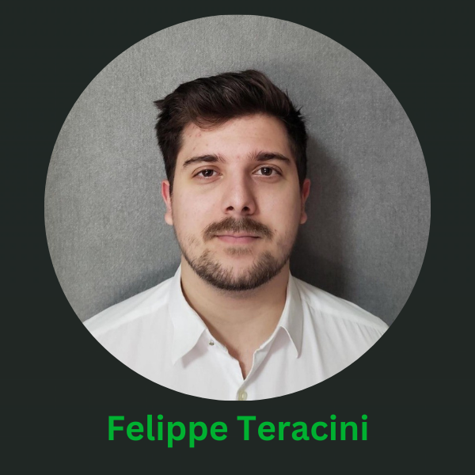

# Vertex/Google Colab

**O que é:**\
Vertex AI é uma plataforma do Google Cloud que unifica todo o ciclo de vida de Machine Learning (ML), facilitando a criação, treinamento e implantação de modelos de aprendizado de máquina. Com o Vertex AI, é possível gerenciar modelos em escala, automatizar tarefas repetitivas e integrar pipelines de dados com outras ferramentas do Google Cloud. Já o Colab (Google Colaboratory) é um ambiente de desenvolvimento baseado na nuvem que permite a execução de código Python diretamente no navegador, sendo muito utilizado para experimentos e protótipos de modelos de ML. Colab oferece integração com outras ferramentas como o Vertex AI, possibilitando um fluxo contínuo de trabalho.

<strong>Quem pode ajudar:</strong>

.png>)

**Quem fornece os acessos:**\
Matheus Damasceno, conhecido como "Mineiro," é responsável por conceder os acessos necessários ao Vertex AI e ao Colab.

**Onde posso estudar:**\
Para aprender mais sobre Vertex AI e Colab, aqui estão algumas ótimas fontes de estudo:

* [Google Cloud Skills Boost](https://www.cloudskillsboost.google): Plataforma de aprendizado com cursos práticos sobre Vertex AI e outras ferramentas do Google Cloud.
* [Coursera - Machine Learning on Google Cloud](https://www.coursera.org/): Curso focado no uso de Vertex AI e outras soluções de ML da Google Cloud.
