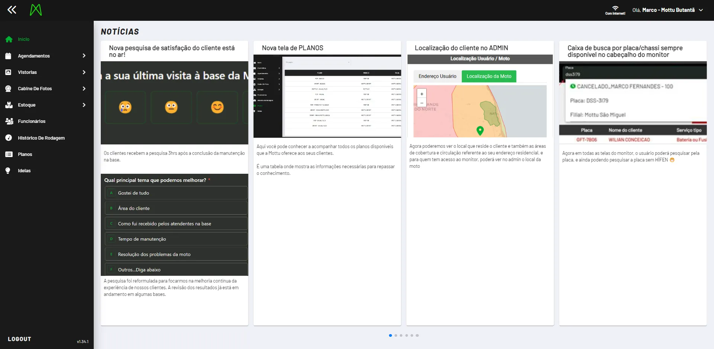

# Rental

Sistema onde temos as principais informações da empresa, sobre agendamento de manutenção/retirada, cabine de fotos, estoque, informação de colaboradores e outros.

V3: [ https://admin-v3.mottu.cloud/](https://admin-v3.mottu.cloud/)

<figure><figcaption></figcaption></figure>

V2: [https://admin.mottu.cloud/](https://admin.mottu.cloud/)

<figure><figcaption></figcaption></figure>

Entre as ferramentas que utilizamos, está também o Monitor. Um sistema de monitoramento para acompanharmos a localização de todos nossos ativos.\
Ferramenta indispensável para o atendimento do serviço de rua, do monitoramento do CS e recuperação de motos

Monitor: [https://monitor.mottu.cloud/](https://monitor.mottu.cloud/)

De forma geral, o monitor oferece:

<figure><figcaption></figcaption></figure>

E de forma mais granular, conseguimos acompanhar a movimentação do usuário:

<figure><figcaption></figcaption></figure>
