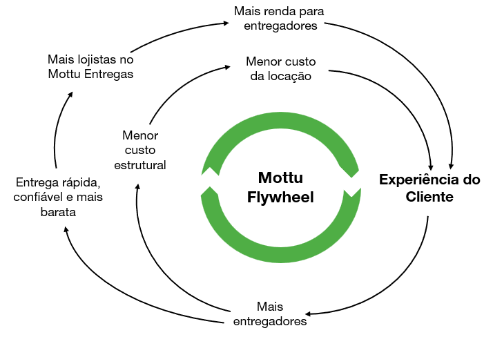
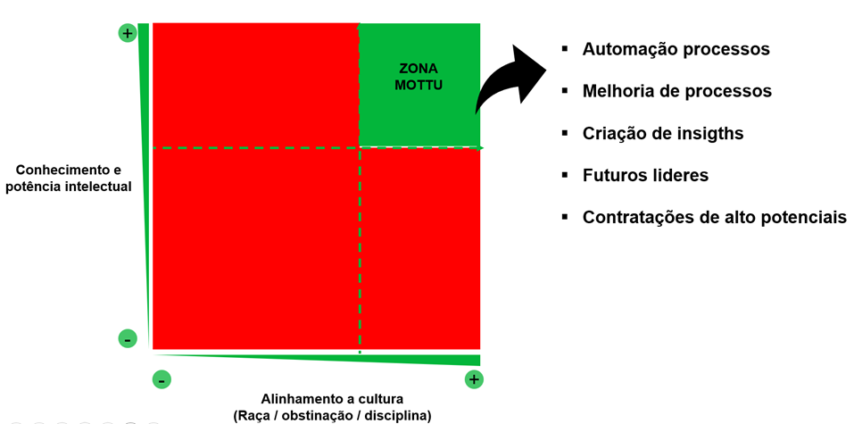

# Cultura Mottu

## <mark style="color:green;">I. A Mottu</mark> 

### <mark style="color:green;">História</mark> 

Após 3 anos de muitos aprendizados em sua primeira _startup_ de _SaaS B2B_, que não cresceu como Rubens almejava, ele parou para refletir e pesquisar por um problema real que estivesse pronto para resolver. Viajou para Israel e para os EUA para conhecer melhor o ecossistema de _venture capital_ global e notou que o mundo trilha, a passos largos, uma jornada de busca por ganhos de eficiência e produtividade com tecnologia em todas as indústrias. Apesar de parecer muito positivo, tais ganhos aumentam o problema do desemprego, ou seja, as pessoas que não tiveram a oportunidade de estudar para adquirir as habilidades que este novo mercado de trabalho demanda, terão cada vez mais dificuldade em manter sua empregabilidade.

Com essa visão enquanto estudava sobre a ineficiência do mercado de logística na América Latina, Rubens percebeu que o investimento na infraestrutura de entrega de _last mile_ é feito pelos próprios microempreendedores (entregadores), um público de baixa renda e sem acesso a crédito. Foi então que ele imaginou que dar acesso a uma motocicleta poderia representar a oportunidade que muitas pessoas precisavam para começar a trabalhar, ao mesmo tempo em que desenvolveria o ecossistema de entregas de última milha na região.

Em janeiro de 2020, a Mottu foi criada visando testar um novo modelo de negócio: alugar motos econômicas e confiáveis a um público formado por pessoas físicas, majoritariamente de baixa renda, interessadas em trabalhar e gerar renda no ramo de _delivery_. Depois de conversar com diversos entregadores que usavam a moto e a bicicleta como meio de transporte, conseguiu identificar as principais dores enfrentadas pelos entregadores. Desenvolveu com a Mottu um produto que engloba toda estrutura necessária para o sucesso dos clientes, desde a manutenção, o suporte de rua, a proteção em face de danos a terceiros e a rápida recuperação das motos em casos de furto, roubo e inadimplência.

Desde o início, escalar um negócio como esse passava por resolver problemas como o alto risco de perda dos ativos por roubo, inadimplência e mau uso. Seria primordial o uso de muita tecnologia e a construção de uma cultura austera, com foco na eficiência operacional e na experiência do cliente. E isso não seria nada fácil.

O controle e rastreamento de cada moto foi o primeiro desafio. Com tecnologia própria, a Mottu criou uma solução que vai do hardware ao software, equipando cada moto com um localizador, que garante o monitoramento e a segurança da frota, além de viabilizar o suporte 24/7 aos clientes. Na sequência, o crescimento demandou a construção de outros sistemas, além do aprendizado de que o sucesso dos clientes da locação estava condicionado ao ingresso deles nos aplicativos de _delivery_ e, portanto, não bastava somente a Mottu dar acesso à ferramenta de trabalho, também era necessário gerar trabalho para eles. Nasceu então o Mottu Entregas, uma plataforma de logística voltada integralmente para os clientes da Mottu - de fácil acesso e que possibilita maior geração de renda quando comparada aos aplicativos disponíveis no mercado. E foi a partir do lançamento do Mottu Entregas que a história mudou e pessoas que já tinham motos próprias passaram a alugar uma Mottu, deixando evidente que o aluguel era somente a fundação de algo maior, um novo ecossistema que começava a ganhar forma. Uma empresa que quanto mais cresce e mais forte se faz, mais impacto gera e mais vidas transforma.

Apesar de todas as dificuldades inerentes à implantação de um negócio complexo e sem referências no mercado, a Mottu cresce em uma velocidade única quando comparada ao mercado de _startups_ no Brasil e no mundo. Em 4 anos e meio, foram atingidas marcas expressivas: mais de 70.000 clientes ativos alugando nossas motos, mais de 3.000 colaboradores, 1 milhão de entregas por mês e a expansão para mais de 60 cidades ao longo de todo o Brasil, além de 5 cidades no México. Além disso, em tempo recorde, a Mottu inaugurou em Manaus a 3ª maior montadora de motos do Brasil que sustenta o fornecimento de motos para nosso crescimento acelerado. Já possuímos 2 Centros de Distribuição, em Recife e São Paulo, que garantem o suprimento de peças em uma malha que abastece nossas bases ao longo de todo Brasil. Ainda por cima, já iniciamos o plano de venda de motos usadas, para permitir que pessoas do Brasil todo conquistem sua moto e mantenhamos nossa frota do aluguel sempre renovada. Para esses clientes que compram nossas motos, e precisam realizar a manutenção delas, vendemos as peças das motos em marketplace próprio, ou realizamos a manutenção nas mesmas bases do Aluguel de Motos.

Tal crescimento fez com que investidores globalmente reconhecidos apostassem na Mottu. Michael Moritz, Verde Asset Management, Marcelo Claure (Bicycle) e QED apostaram na empresa nas rodadas de investimento, e fazem parte do conselho da companhia. Além disso, o crescimento da Mottu é sustentado primordialmente pela emissão de dívidas. Já levantamos mais de R$1 bilhão em investimentos entre equity e dívidas, para compra de ativos e expansão de nossas operações. Temos muito orgulho de sermos uma empresa lucrativa antes das outras start-ups do ecossistema de empreendedorismo brasileiro, fruto de nossa cultura de austeridade. Além das mais de 280.000 pessoas que auxiliamos a renda diretamente e indiretamente, existem mais de 150 pessoas que estão construindo a Mottu e fazem parte do plano de remuneração por Stock Options.

### <mark style="color:green;">Unidades de Negócio</mark> 

* **Mottu Aluguel**: operação de aluguel de motos composta pelo aluguel, além de manutenção, suporte de rua e proteção em face de danos a terceiros;
* **Mottu Entregas**: plataforma de logística _last mile_, que conecta os clientes da Mottu Aluguel com empresas que demandam serviços de entregas;
* **Mottu&#x20;**_**Manufacturing**_: operação de montagem de motocicletas à combustão e elétricas;
* **Mottu Store**: marketplace de venda de peças e artigos para motos;

### _<mark style="color:green;">Flywheel</mark>_ <mark style="color:green;"></mark><mark style="color:green;">da Mottu</mark> 

**Uma nova realidade sendo criada**: o time da Mottu é obcecado pelo propósito de aumentar a renda e diminuir o custo dos clientes. Por isso, ser cliente Mottu é muito mais fácil e rentável do que comprar uma moto própria. Ao **alugar uma Mottu**, o cliente economiza com manutenção, seguro, IPVA, licenciamento, conta com suporte 24/7 e otimiza o seu tempo de trabalho. E através do **Mottu Entregas**, os clientes têm a possibilidade de gerar mais renda desde o primeiro dia com a moto alugada. Com a **Mottu&#x20;**_**Manufacturing**_, identificamos melhorias de produtos para construir a melhor moto do mercado para entregadores, econômica e com baixo custo de manutenção.

Toda essa experiência torna incontestável a decisão de fazer parte da Mottu ao invés de ter uma moto própria para trabalhar. Com mais motos nas ruas, o serviço de entregas se torna mais confiável e rápido, fazendo com que cada vez mais empresas optem por operar sua logística com a Mottu - que quanto mais cresce, mais forte, robusta e completa fica!

<figure><figcaption>
Mottu Flywheel
</figcaption></figure>

### <mark style="color:green;">Manifesto Mottu</mark> 

_Acreditamos no poder das pessoas em transformar realidades._

_No trabalho dos que acordam cedo, nos mais diversos cantos da cidade, em busca de uma vida melhor._

_Na força de quem vai à luta, independente de sol, chuva, trânsito e perrengues da vida._

_Em quem enfrenta a indiferença e supera cada obstáculo para conquistar os seus sonhos._

_Quem batalha pelo seu sustento e para dar o melhor para quem ama._

_Acreditamos num mundo conectado e descomplicado, com soluções tecnológicas e inovadoras que melhorem as nossas vidas._

_Acreditamos na superação, na igualdade de oportunidades, na união e, principalmente, no poder de estender a mão e construir juntos!_

_Em mudar a forma como as pessoas pensam, se movimentam e consomem._

_Acreditamos que vamos transformar o mundo:_

_Nós somos raiz, nós somos Mottu._

### <mark style="color:green;">Cultura, Valores e Princípios</mark> 

Na Mottu temos a consciência de que nosso sucesso e nosso legado estão vinculados aos nossos princípios, valores e à forma como conduzimos os desafios do dia a dia. Acreditamos que cultura forte, paixão e sentimento de dono são os fatores que vão definir quão longe vamos chegar. Afinal, temos a certeza de que, para resolver um problema tão relevante quanto o que estamos atacando, com uma operação intensa e complexa, o desafio é enorme e precisamos de muita obstinação. Nesse contexto, para entregar crescimento na velocidade que queremos, é preciso um time com muita coragem, atitude, protagonismo, brilho nos olhos, disciplina e, principalmente, senso de urgência. Por isso, só podemos ter ao nosso lado, como parte dessa jornada, pessoas que querem construir o extraordinário, que compartilham de nosso propósito, acreditam na nossa cultura, e que realmente estão dispostas a fazer a diferença e as renúncias necessárias para compor um time de elite - empreendendo ombro a ombro e confiando uns nos outros.

#### <mark style="color:green;">**Valores e Princípios:**</mark>

<mark style="color:green;">**1- Foco no cliente**</mark>

A Mottu nasceu para dar oportunidades às pessoas que nunca tiveram uma. Tudo é pensado com o intuito de melhorar a vida dos clientes e ajudá-los a conquistar os seus sonhos.

<mark style="color:green;">**2- Senso de urgência**</mark>

O cliente da Mottu geralmente está atrasado, sozinho, debaixo de sol e chuva, exposto aos riscos do trânsito, trabalhando para dar sustento a quem ama. Por isso, quando os clientes precisam, nosso time está de prontidão para imediatamente ajudá-los. Na Mottu a regra é ser rápido e nunca deixar para amanhã o que se pode fazer hoje; resolvemos os problemas dos clientes na raiz e imediatamente!

<mark style="color:green;">**3- Mão na Graxa**</mark>

Arregaçamos as mangas e fazemos nós mesmos as coisas para sabermos o caminho de melhorá-las. Trabalhamos no dia-dia da operação, entendemos com profundidade os assuntos e respeitamos a opinião de quem esteve na ponta da lança acima de todas as outras.

<mark style="color:green;">**4- Cabeça de dono**</mark>

Na Mottu só há espaço para quem quer gerar impacto, com autonomia e coragem para tomar decisões e se responsabilizar por elas. Aqui todos trabalham como donos, sem vaidade e com sangue nos olhos para construir uma jornada relevante e que deixe um legado. Cuidamos de cada centavo da companhia e investimos tempo e dinheiro somente no que realmente gera valor para os clientes.

<mark style="color:green;">**5- Ombro a ombro**</mark>

Todos na Mottu têm o mesmo propósito: melhorar a vida dos clientes e as suas próprias. Nesse sentido, para construir uma empresa realmente diferenciada, que gera impacto relevante na sociedade, é fundamental formar um time forte e engajado, com membros que realmente se ajudam e confiam uns nos outros. Na Mottu, nossa sinceridade e paixão constroem relações verdadeiras de confiança e de trabalho ombro a ombro mil vezes mais forte do que em qualquer outro lugar!

<mark style="color:green;">**6- Tecnologia em tudo!**</mark>

Utilizar tecnologia e os dados coletados diariamente de forma inteligente é a única forma de possibilitar que a Mottu alcance relevância, excelência nos serviços, processos, e controles para tornar a jornada dos clientes cada vez mais valiosa, _no-touch_ e sem fricção. Por isso, aprenda ao máximo como utilizar tecnologia e dados ao seu favor.

<mark style="color:green;">**7- Profundidade**</mark>

Buscamos a solução dos nossos problemas no último nível de profundidade que podemos. Somos incansáveis, mergulhamos em busca das soluções e vamos até o fim no que começamos.

<mark style="color:green;">**8- Honestidade intelectual**</mark>

Na Mottu temos clareza que não estamos preparados para os desafios que virão, por isso precisamos ser humildes, curiosos e ávidos por conhecimento para evoluirmos na velocidade necessária, buscando constantemente nos manter relevantes ao negócio e como fonte de inspiração para nosso time, nunca perdendo de foco nosso propósito.

<mark style="color:green;">**9- Austeridade**</mark>

Cada centavo gasto precisa gerar retorno para clientes e acionistas. As pessoas que alugam uma Mottu são majoritariamente de baixa renda e os clientes que utilizam o serviço de logística buscam reduzir cada vez mais o custo do frete em suas operações. Ou seja, não há margem para erros, e trabalhar com austeridade e simplicidade é o único caminho a seguir para perpetuar a posição de primeira escolha para os nossos clientes.

## <mark style="color:green;">II. Estrutura Organizacional</mark> 

A Mottu preza por uma organização horizontal, na qual os líderes têm protagonismo, autonomia e responsabilidade sobre as decisões - desde que estejam alinhadas com a estratégia e com os princípios da empresa. Essa estrutura enxuta possibilita uma gestão rápida para ajustar a rota caso se perceba que o resultado esperado não está sendo produzido.

A liderança na Mottu é composta por 3 figuras relevantes: a primeira camada é composta pelos _Buiness Analysts e Trainees,_ que tocam o dia dia da operação e coordenam times de tecnologia e operações; a segunda camada é constituída pelos _Technical Product Managers,_ que são responsáveis pelo produto e tecnologia da Mottu, trabalhando junto com as operações para encaminharem nosso time de engenharia no melhor caminho. Por fim, existe a figura dos _Heads_ de área, que junto aos diretores executivos e de tecnologia, garantem que a estratégia desenhada para os times está sendo executada - mentorando e ajudando os _Business Analysts, Trainee’s e Technical_ Product _Managers_.

### _<mark style="color:green;">Business Analysts e Trainees</mark>_ 

Os _business analysts_ e _Trainees_ na Mottu têm um papel fundamental na operação do dia dia, identificando e resolvendo problemas que impactam a companhia e o cliente. Eles são protagonistas para traçar o planejamento e unir o time operacional, _technical product managers_ e diretores de tecnologia e executivos, garantindo que os desafios traçados sejam efetivamente endereçados através de um trabalho analítico e investigativo.

Para executar suas responsabilidades com excelência, os _Business Analysts_ e os _Trainees_ devem (i) ser altamente competentes tecnicamente, não só em análise de dados, mas também em desenvolvimento de software, (ii) conhecer o produto e o cliente, e (iii) saber comunicar e executar as estratégias junto ao time operacional. Com isso, eles devem construir soluções escaláveis de alto impacto, que possam ser implementadas de maneira ágil e com baixo custo. Estão sempre em busca de maneiras inovadoras de otimizar processos e resolver problemas utilizando tecnologia e dados.

#### <mark style="color:green;">**Principais Responsabilidades dos**</mark><mark style="color:green;">**&#x20;**</mark>_<mark style="color:green;">**Business Analysts e Trainees**</mark>_<mark style="color:green;">**:**</mark>

* São responsáveis por um processo/operação da Mottu;
* Analisam dados para a identificar as maiores oportunidades da área;
* Tem amplo conhecimento do produto, do cliente e do time;
* Protagonizam a implementação das principais mudanças e melhorias que impactam a sua área;
* Automatizam processos repetitivos e adicionam tecnologia em suas principais frentes de trabalho;
* Definem e alinham as principais estratégias junto aos _Technical Product Managers, Heads e Diretores_.

### _<mark style="color:green;">**Technical Product Managers na Mottu**</mark>_

O _Technical_ _Product Manager_ é o principal responsável pelo sucesso dos produtos e processos que gerencia. Isso significa ter autonomia para implementar projetos e mudanças que visem entregar o melhor resultado para o cliente e para a empresa.

Os _Technical_ _Product Managers_ fazem a gestão dos times de tecnologia e devem conduzir com excelência os rituais ágeis e de desenvolvimento de produtos.

Uma das principais atividades do _Technical_ _Product Manager_ é planejar as tarefas junto com o time de tecnologia para evoluir constantemente seus produtos e processos. Para fazer isso com qualidade e agilidade, deve possuir considerável experiência no desenvolvimento de software (_Technical Product Managers_ possuem conhecimento avançado em programação), análise de dados, prototipação, _UI/UX_, e devem saber executar as atividades operacionais da sua área, além de conhecer o cliente e o mercado de seu produto como ninguém. A partir disso, o _Technical Product Manager_, junto com seu time de engenharia, propõe soluções, executa seu plano e o entrega, dentro do prazo acordado e com qualidade.

As definições e soluções propostas devem ser muito bem fundamentadas com dados. _Technical_ _Product Managers_ são sempre céticos quando os dados e o bom senso não estão alinhados. Eles sempre vão a fundo nos problemas para descobrir as inconsistências e trabalham para propor soluções na causa raiz.

O _Technical Product Manager_ também deve coordenar esforços com outras equipes, visando alinhar soluções escaláveis e integrativas, seja para atender demandas relativas aos seus produtos ou mesmo para absorver demandas e resolver problemas da sua área que estejam impactando ou impedindo o progresso de outros _Technical Product Managers_.

#### <mark style="color:green;">**Principais Responsabilidades do**</mark><mark style="color:green;">**&#x20;**</mark>_<mark style="color:green;">**Technical**</mark>_ _<mark style="color:green;">**Product Manager:**</mark>_

* Desenvolvem o time e formam novas lideranças;
* Conhecem o seu cliente profundamente, vivendo as mesmas experiências que seus usuários para ganhar profundidade no problema;
* Possuem total conhecimento do mercado de atuação de seu produto e tem a capacidade de propor soluções simples;
* São referência no conhecimento operacional e processual da sua área;
* Desenvolvem o _roadmap_ do produto baseado em dados, criam as _work itens_ e garantem o seu entendimento por toda equipe;
* Lideraram os rituais de desenvolvimento do produto;
* Analisam os indicadores dos produtos com foco em escala e melhoria contínua, tanto do ponto de vista do cliente quanto da companhia;
* Garantem que o time de engenharia esteja extremamente desafiado, motivado e buscam as melhores soluções em conjunto com a equipe;
* Certificam a qualidade dos seus produtos e do trabalho do seu time;
* São um exemplo para sua equipe e pares.

### _<mark style="color:green;">Heads</mark>_ <mark style="color:green;"></mark><mark style="color:green;">e</mark> <mark style="color:green;"></mark>_<mark style="color:green;">Diretores</mark>_ 

Os _Heads_ e os diretores executivos e de tecnologia são responsáveis pelo alinhamento entre o planejamento das áreas e o _course of action_ das implementações de processos e produtos com a estratégia da companhia. Eles precisam saber detalhadamente tudo o que está sendo feito pelas equipes, com qual objetivo e qual o resultado esperado de cada ação.

Precisam ter profundo conhecimento operacional da empresa e visão de plataforma, com o objetivo de ser o elo que conecta todos os processos e todas as áreas. Os _Heads_, em conjunto com os diretores executivos e de tecnologia, garantem o direcionamento e o alinhamento do _roadmap_ de produto e negócios de todas as áreas, de forma a entregar o maior valor possível para o cliente final, de forma eficiente e sinérgica. Isso pode significar desde ajudar a equipe a definir quais as principais dores a serem resolvidas até priorizar demandas que estão impactando outras áreas ou o desenvolvimento de produtos de outra equipe.

Além disso, os _Heads_ são diretamente responsáveis pelo sucesso das áreas/produtos que estão mentorando, podendo ser requisitados para negociações, ajuda com recrutamento ou até mesmo no _kick-off_ de uma operação. É esperado que gaste 1/3 do seu tempo ajudando as áreas na execução de seus processos, a fim de ganhar profundo conhecimento operacional e conseguir ter boas discussões com os _Business Analysts, Trainee’s e Technical Product Managers._

Os _Heads,_ diretores executivos e de tecnologia também desempatam conflitos e tiram impeditivos das áreas, ajudam nas definições de produto e operação da empresa e entram na execução para fazer acontecer quando necessário.

Portanto os _Heads,_ em conjunto com os diretores, são os guardiões dos principais indicadores da companhia, garantindo alinhamento das atividades dos _Business Analysts, Trainee’s e Technical_ _Product Managers_ com os _KPI’s_ definidos, e o relacionamento dos _KPI’s_ das áreas com o planejamento financeiro e estratégico da empresa.

#### <mark style="color:green;">**Principais Responsabilidades dos**</mark><mark style="color:green;">**&#x20;**</mark>_<mark style="color:green;">**Heads e**</mark>_<mark style="color:green;">**&#x20;**</mark><mark style="color:green;">**Diretores**</mark>

* Direcionam e alinham o _roadmap_ de tecnologia e negócios das áreas com a estratégia da empresa;
* Possuem coerência na gestão de dependência no _roadmap_ das áreas;
* Definem metas desafiadoras e ambiciosas;
* Acompanham os _KPI’s_ junto às áreas;
* Resolvem conflitos e problemas;
* Garantem que os líderes e membros de suas áreas estão motivados e desafiados;
* Formam de líderes cada vez mais capazes e autônomos;

### <mark style="color:green;">Modelo de Gestão</mark> 

#### <mark style="color:green;">**Documento escrito de resultados**</mark>

As _Weeklies/_&#x4D;esas Redondas são reuniões de _reporting_ lideradas pelo _Head_ da área. A frequência e o dia de cada reunião são semanais ou a cada 15 dias, em função da pluralidade de temas que estão englobados nas áreas.

Os principais participantes da reunião são os membros do time que tocam os processos, o _Technical_ _Product Manager_ com seu time, o _Head_ da área e as figuras que o _Head_ da área julga importantes para avançar o tema e os Diretores Executivos da companhia.

Os participantes das _Weeklies/_&#x4D;esas Redondas junto com seu time, deve preparar o documento com antecedência, incluindo a visão da área, os principais entregáveis para as próximas semanas, e indicar:

* Avanços da última quinzena, compartilhando dificuldades enfrentadas;
* Principais indicadores da área, comentando grandes variações e resultados relevantes;
* Prioridades do próximo ciclo;
* Necessidades de ajuda, quando necessário, descrevendo pontos específicos nos quais têm enfrentado dificuldade e não conseguiu progredir;
* Mapeamento dos gargalos que dependem de outras áreas.

Com o documento concluído, os participantes da reunião se unem a fim de identificar/resolver gargalos, melhorar o alinhamento do time com a estratégia da companhia e subir a barra da equipe. Para isso, todos presentes devem ter bom entendimento da operação de cada área e dos desenvolvimentos de tecnologia que estão planejados e em andamento.

Em seguida, ao longo da semana, são realizadas reuniões de aprofundamento em temas necessários, e os combinados do último report são executados pela equipe participante.

Ao final de todo o processo, espera-se que cada área esteja com prioridades claras e alinhadas para as próximas semanas, tanto na parte operacional quanto de tecnologia.

## <mark style="color:green;">III. Processo de Avaliação</mark> 

### <mark style="color:green;">Ogro x Intelectual x Desafio</mark> 

A principal responsabilidade dos _heads_ e diretores executivos é o processo de avaliação de desafio e desempenho da equipe. Não existe nada mais importante do que ter as pessoas certas e desafiadas nos temas que movem o ponteiro.

Há muita potência dentro dos indivíduos que precisamos saber identificar e deslanchar. As pessoas que dedicam suas vidas ao propósito da Mottu merecem estar nos desafios certos (“osso maior que a boca”) e com autonomia para empreender e fazer acontecer. Além disso, só podemos ter ao nosso lado gente que enxergamos como sócios relevantes no futuro devido a forte aderência cultural, potência intelectual e habilidade de execução.

Por isso, os _heads_ e diretores são responsáveis por garantir que ocorra periodicamente um processo no qual todos os líderes da companhia avaliam o desafio e performance de cada um de seus membros de equipe.

Neste processo de avaliação, são pontuadas as dimensões (i) ogro, (ii) intelectual, (iii) desafio, para compor um olhar sobre cada indivíduo e então derivar as recomendações para atingir barra muito alta em toda equipe.

#### <mark style="color:green;">**Eixo Ogro (1 a 5)**</mark>

* Vai até o final em todos os desafios, não para em obstáculos, postura "sem desculpas";
* Chega no horário e sai depois do horário, sempre disponível para nossos clientes;
* Proativo e não precisa ser "motivado" e "direcionado". Vai tentar resolver os problemas por conta própria, só subindo paro o gestor o que realmente não tem mais alternativas;
* Gera atrito e desgaste com status quo para entregar o que precisa ser entregue;
* Desprovido de vaidade, humilde e mão na massa. Não deixa seu ego interferir em decisões;
* Forte viés de execução, consegue canalizar sua energia para avançar na agenda sem se prender a detalhes irrelevantes nem andar em círculos.

#### <mark style="color:green;">**Eixo Intelectual (1 a 5)**</mark>

* Insight: enxerga as coisas de forma original e encontra oportunidades antes não vistas, gera insights;
* Conhecimento: agrega nas discussões e construções da área com seu conhecimento de algum tema;
* Aprendizagem: tem interesse e capacidade de aprender coisas novas que serão úteis (não só falar que quer aprender e fazer cursos);
* Capacidade de pensar e implementar soluções simples, elegantes e escaláveis via tecnologia e dados;
* Consegue e gosta de ensinar e passar conhecimento, domina e sabe explicar conhecimentos avançados de maneira simples.

#### <mark style="color:green;">**Avaliação do Desafio**</mark>

* 80% - Desafio menor do que potencial, risco de perda
* 100% - Tem pista para atingir seu melhor
* 120% - Sweet spot
* 150% - Precisa ajuda

### <mark style="color:green;">Etapas do processo de avaliação</mark> 

O processo ocorre duas vezes por ano e segue a seguinte linha do tempo:

1. Cada gestor mapeia todas as pessoas do seu time em preparação a avaliação;
2. Para cada pessoa do time, o gestor escreve um breve job description do que deveria ser o papel desta vaga que a pessoa ocupa;
3. Ao contrastar o escopo real em relação ao job description, gestor identifica oportunidades de melhoria de alocação de pessoas, alocação de tempo da pessoa, e definições de escopo (in e out) para tomar ação: coach a pessoa, puxar mais, substituir, dividir escopo, aumentar autonomia/delegar, etc.;
4. Gestor então realiza a avaliação individual nos exios ogro, intelectual e desafio, sempre calibrado em relação a régua alta da Mottu e os critério objetivos, evitando vieses psicológicos e pensando no melhor para Mottu;
5. As avaliações são discutidas entre o gestor e seu Head para fins de (i) refinar calibração, (ii) provocarem-se sobre como extrair mais e o melhor das pessoas, (iii) definirem próximos passos de cada indivíduo para garantir que só temos pessoas que vemos como sócios relevantes nos próximos anos e que operam na zona Mottu de alta aderência cultural e potência intelectual;
6. Gestor (e head, quando pertinente), conversam individualmente com cada pessoa para obter seu ponto de vista, pactuar o plano de ação para melhoria, e dividir todo feedback e coach que ajude levar para próximos patamares.

### <mark style="color:green;">Resultados</mark> 

* Baseado em suas notas de Ogro x Intelectual, as pessoas serão classificadas em:
  * Abaixo das expectativas (Ogro ou intelectual Î {1, 2});
  * Atende expectativas (Ogro ou intelectual Î {3});
  * Excede expectativas (Ogro e intelectual Î {4, 5});

Isto significa que para estar acima das expectativas, ambas as notas Ogro e Intelectual precisam ser 4 ou 5, e que para estar abaixo das expectativas basta uma das notas Ogro ou Intelectual serem 1 ou 2.

* Baseado na avaliação, há três opções possíveis:
  * _**Abaixo das expectativas**_**:** deverão ser desligados sem reposição ou, alternativamente, ou substituídos por pessoa de alto potencial. Temos que refletir a razão pela qual isso ainda não havia ocorrido, e quais foram nossas falhas que levaram ao aceite da mediocridade até este momento.
  * _**Atende expectativas**_: caso não haja evolução por 2 semestres consecutivos, avaliar rotação de liderança para outro desafio ou substituição por trainee de alto potencial.
  * _**Excede expectativas:** &#x64;_&#x65;vem estar em desafios com _challenge 120%_ e liderando as principais frentes de negócio, elegíveis a SOP.

## <mark style="color:green;">IV. Programa</mark> <mark style="color:green;"></mark>_<mark style="color:green;">Bar Raising</mark>_ 

A Mottu tem como princípio atuar de modo a sempre subir a barra do time e considera isso primordial para a construção de uma equipe _high performance_ e para o efetivo alcance dos objetivos traçados.

Para isso, foi desenvolvida a cultura de _bar raising_, que visa garantir que todo time esteja alinhado à cultura da empresa e que isso seja refletido no dia a dia da organização, elevando a barra para que todos sejam melhores e evoluam, dia após dia.

O programa de _bar raising_ identifica e nomeia os guardiões da cultura e o time de elite da Mottu, cujo objetivo é unir todos em torno de um mesmo propósito, voltado à melhoria contínua. Eles são referências dentro da companhia, guardiões dos princípios Mottu e subirão a barra todos os dias. Os _bar raisers_ devem sempre zelar e evocar a cultura da empresa, dentro e fora da sua área, inspirando todos a serem exemplos vivos dos princípios e valores da Mottu.

Os _bar raisers_ também são responsáveis por realizar entrevistas com novos candidatos. Todos os candidatos, a qualquer vaga, deverão ser entrevistados por pelo menos 3 _bar raisers_ que não possuem relação direta com a vaga em questão - eliminando, assim, o sentimento de urgência da contratação, conduzindo avaliação do potencial e do _fit_ cultural do candidato. Para que ele seja aprovado, os 3 _bar raisers_ devem consentir.

### <mark style="color:green;">**Critérios para ser um**</mark><mark style="color:green;">**&#x20;**</mark>_<mark style="color:green;">**Bar Raiser**</mark>_

Os _bar raisers_ são voluntários com experiência no recrutamento de talentos e totalmente aderentes aos princípios da Mottu. Os _bar raisers_ terão uma agenda trimestral com o _CEO_ da empresa para avaliar e gerar _insights_ sobre as últimas entrevistas conduzidas e também participarão de um programa de treinamentos para exercer a função. O objetivo é garantir que o programa sempre seja liderado pelos melhores e resulte em excelentes contratações.

### <mark style="color:green;">O Processo de Recrutamento Mottu</mark>

1. _**Job description**_: o líder da área escreve o _job description_ da posição e submete, via Gupy, para aprovação;
2. **Aprovação da vaga**: o _Head_ da área é responsável pela aprovação das vagas com o _CEO_;
3. **Entrevistas**: considerando que o foco da Mottu é buscar pessoas que elevarão o nível do time para um próximo patamar, todos os envolvidos têm a obrigação de contratar candidatos melhores do que os membros atuais, filtrando apenas profissionais alinhados com a cultura da empresa. Em todas as etapas, os principais critérios de avaliação serão: conhecimento funcional, capacidade de aprendizagem, potência intelectual, valores e cultura.

#### **Etapas:**

**Primeira etapa:** entrevista para contar sobre a Mottu, desafios e cultura, e identificar se o candidato está alinhado;

**Segunda etapa:** entrevista técnica para checar se o candidato possui os _skill_ necessários para vaga;

**Terceira etapa:** entrevista com 2 _bar raisers_ que não possuem relação direta com a vaga;

**Quarta etapa:** proposta é comunicada pelo líder da área e, em seguida, formalizada pelo RH.

### <mark style="color:green;">Tribos e rituais do Bar Raiser</mark>

Os Bar Raisers são divididos em Tribos, por exemplo: “Liderança”, “Tech”, “Dados”, “Cultura, “Frugal/Finanças”, “Talentos”. Esses grupos conduzem rituais e rotinas que reforçam a forma que de trabalho, os valores e princípios da Mottu.

## <mark style="color:green;">V. Conclusão</mark> 

Estamos endereçando um problema relevante para a sociedade e, para sermos bem sucedidos no longo prazo, precisamos construir uma empresa que seja melhor a cada dia que passa. A obsessão por melhorar os nossos indicadores semana após semana é fundamental.

O compromisso que temos com os nossos clientes não nos permite qualquer descanso e, por isso, a Mottu será uma referência em inovação e desenvolvimento de pessoas. Seremos uma empresa permanentemente focada em solucionar as dores daqueles que utilizam os nossos produtos na busca de uma vida melhor.

Este manual, tal como qualquer outro documento ou processo da Mottu, deverá ser seguido e regularmente atualizado e melhorado, por líderes cada vez mais capacitados, com vistas à longevidade e perpetuidade desta organização, que nasceu para ser centenária.
